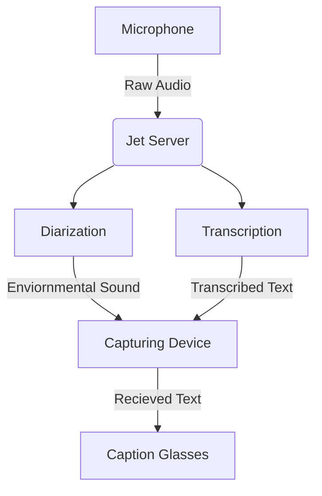

Captioning Heads Up Display Glasses (or CHUD Glasses) is a project started by in 2025. The goal is to create glasses that will listen to their surroundings and display what people are saying on the inside of the glasses.

## Captioning Process
Below is a flowchart of the Captioning process

Use Python 3.12 for this (not sure what other versions work right now)

## How to set this up locally

 - Make sure you have FFMPEG installed so Python can process the audio from the RTSP stream.
- Install an RTSP server like MediaMTX, or set up a stream in VLC or any other software that can provide an RTSP stream.
- Install the dependencies from `requirements.txt`.
- Start the RTSP stream by connecting an audio source to a specific RTSP server (see below on how to start the stream).
- Run `python rtsp.py --model [model] --rtsp_url [rtsp_url]` to start processing input. The default model is `tiny`. 
- Start `listener.py` to receive JSON data from the websocket.

## How to start an RTSP stream

### Windows
Use FFmpeg with `dshow` to capture your microphone and stream it to the desired URL, as shown below.

    ffmpeg -f dshow -i audio="[mic name]" -ac 1 -ar 16000 -c:a pcm_s16le -f rtsp -rtsp_transport tcp [your rtsp url]

You can get available devices by running `ffmpeg -list_devices true -f dshow -i dummy`.

### Linux
Use FFmpeg with `pulse` or `alsa` to capture the mic input and stream it, as shown below.

    ffmpeg -f [device_manager] -i [mic_name] -ac 1 -ar 16000 -c:a pcm_s16le -f rtsp -rtsp_transport tcp [your rtsp url]
You can get available sources with `pactl list sources short`.
