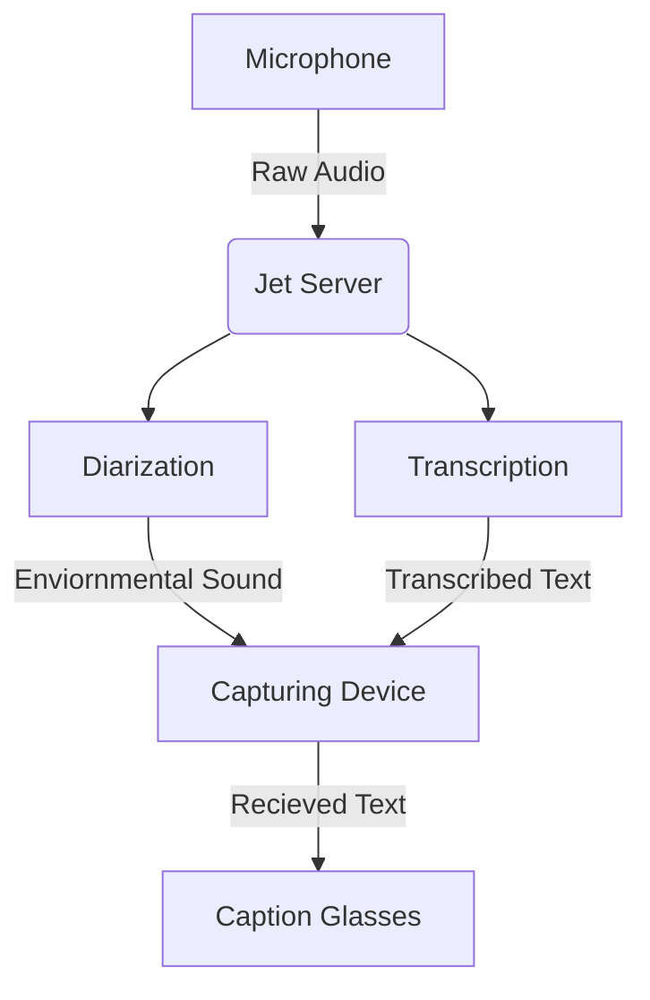

Caption Glasses are a pair of AR glasses that listen to your surroundings and display live captions directly in your field of view.

## Captioning Process
***Below is a flowchart diagram of the captioning process***


Use Python 3.12 for this (not sure what other versions work right now)


## Local Development Guide
*Docker Compose is recommended for running locally*

- Create a virtual environment in the base directory, ensure it is **Python 3.12**.
- Install necessary dependencies for the application
```sh
pip install -r dev-requirements.txt
```
- Run the Docker Compose located in the Server directory
  - If you do not have docker compose, run the port and environment vars manually.
- Wait until the webserver starts on port **2001**, this will take upwards of 4 minutes.
  - You can verify this by going to localhost:2001, if it is up, it will redirect you to the documentation.
- If your microphone on your device uses a sampling rate OTHER THAN 44100, modify the .env variable in .env located in Local_Dev/src
- Once started, run the **pygame_listener.py** script located in Local_Dev/src
- If everything is correct, the transcription app should appear and connect, automatically transcribing from your microphone
